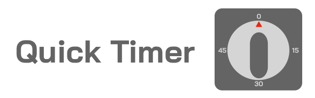

Quick and easy timer with an alarm

**Note: Alarm noise will only work for Windows Linux WSL and Mac**

---

## Features
- Start a timer based on hours minutes and seconds, sequentially separated
  with spaces
- Start a timer by clock finish time (eg. 4:30)
- Start a timer by am/pm whole numbers (eg. 5pm)
- A script can be run instead of an alarm, if it's location is the last
  argument
---

## Setup

### gdate requirement for Mac OS
For this to work on Mac OS you will need gdate. The Mac OS date command's
switches are different to that of Linux. gdate is part of the
coreutils package and can be installed using Homebrew by running the following
```
brew install coreutils
```

### Installation

Clone this repo to your desktop or download the `timer.sh` script

You might want add an alias in your `.bashrc` or `.zshrc` file for quick
access. (eg `alias timer=~/timer.sh`)

---

## Usage examples
For seconds, 15 seconds
```
timer.sh 15
```

5 mins and 20 seconds
```
timer.sh 5 20
```

1 hour 15 mins and 30 seconds
```
timer.sh 1 15 30
```

For clock based time to go off at 6:00pm
```
timer.sh 6pm
```

For clock based time to go off at the next 4:30
```
timer.sh 4:30
```

Timer will run for 30 mins then execute a script
```
timer.sh 30 0 "./test.sh"
```

---
## End switches
`--quiet` : application will not set off an alarm

`--dry-run` : mainly for testing to determine if the end time is correct
