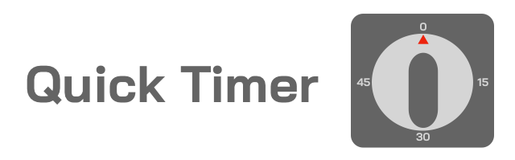
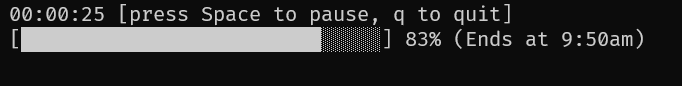

Quick and easy timer with a digital watchclock display and progress bar

## Features
- Displays a real-time progress bar showing countdown progress
- Digital watchclock display showing remaining time
- Pause and quit the timer with keyboard controls
- Starts a timer based on hours minutes and seconds, sequentially separated
  with spaces
- Start a timer by clock finish time (eg. 4:30)
- Start a timer by am/pm whole numbers (eg. 5pm)
- A script can be run instead of an alarm, if it's location is the last
  argument - Prompts for time with the `-p` switch
- Arguments can be "quick clock", am/pm, hours, minutes and seconds
- "Quick clock", is in a 12 hour cycle Eg: Running 9:30 after 9:30am will
  go to the next 12 hour block time of 9:30pm
- Has a `--quiet` switch to not make a noise at the end of the timer

## Setup
### Prerequisites
- `ffplay` (part of ffmpeg) for audio alerts. If not installed, the timer will use a system beep instead

### Linux and Mac
Download the repo and run `make` to build the binary

### Installation
Running `make deploy` will copy the binary to `~/.local/bin`. In order to run as a
local app, `~/.local/bin` will have to be added to your PATH

### Windows
Has to be run inside Windows Terminal (`cmd.exe`)

Run the `deploy.bat` script in the `windows_compile` directory. This will move
the binary to `~/.local/bin`. This will require Administrator mode on the
command line to be able to execute

### Alert notification
The timer includes an embedded audio alert. Audio playback requires `ffplay` (part of ffmpeg).
If `ffplay` is not installed, the timer will use a system beep instead

## Usage examples
For seconds, 15 seconds
```
timer 15
```

5 mins and 20 seconds
```
timer 5 20
```

1 hour 15 mins and 30 seconds
```
timer 1 15 30
```

For clock based time to go off at 6:00pm
```
timer 6pm
```

For clock based time to go off at the next 4:30
```
timer 4:30
```

Timer will run for 30 mins then execute a script
```
timer 30 0 "./assets/example.sh"
```

## End switches
`--quiet` : application will not set off an alarm
`--dry-run` : mainly for testing, timer instantly goes off in quiet mode

